Hey all!

Recently we released [Anubis v1.21.1: Minfilia Warde (Echo 1)](https://github.com/TecharoHQ/anubis/releases/tag/v1.21.1). This is a fairly meaty release and like [last time](../2025-06-27-release-1.20.0/index.mdx) this blogpost will tell you what you need to know before you update. Kick back, get some popcorn and let's dig into this!

{/* truncate */}

In this release, Anubis becomes internationalized, gains the ability to use system load as input to issuing challenges, finally fixes the "invalid response" after "success" bug, and more! Please read these notes before upgrading as the changes are big enough that administrators should take action to ensure that the upgrade goes smoothly.

This release is brought to you by [FreeCAD](https://www.freecad.org/), an open-source computer aided design tool that lets you design things for the real world.

## What's in this release?

The biggest change is that the ["invalid response" after "success" bug](https://github.com/TecharoHQ/anubis/issues/564) is now finally fixed for good by totally rewriting how [Anubis' challenge issuance flow works](#challenge-flow-v2).

This release gives Anubis the following features:

- [Internationalization support](#internationalization), allowing Anubis to render its messages in the human language you speak.
- Anubis now supports the [`missingHeader`](#missingHeader-function) function to assert the absence of headers in requests.
- Anubis now has the ability to [store data persistently on the server](#persistent-data-storage).
- Anubis can use [the system load average](#load-average-checks) as a factor to determine if it needs to filter traffic or not.
- Add `COOKIE_SECURE` option to set the cookie [Secure flag](https://developer.mozilla.org/en-US/docs/Web/HTTP/Guides/Cookies#block_access_to_your_cookies)
- Sets cookie defaults to use [SameSite: None](https://web.dev/articles/samesite-cookies-explained)
- Allow [Common Crawl](https://commoncrawl.org/) by default so scrapers have less incentive to scrape
- Add `/healthz` metrics route for use in platform-based health checks.
- Start exposing JA4H fingerprints for later use in CEL expressions.

And this release also fixes the following bugs:

- [Challenge issuance has been totally rewritten](#challenge-flow-v2) to finally squash the infamous ["invalid response" after "success" bug](https://github.com/TecharoHQ/anubis/issues/564) for good.
- In order to reduce confusion, the "Success" interstitial that shows up when you pass a proof of work challenge has been removed.
- Don't block Anubis starting up if [Thoth](/docs/admin/thoth/) health checks fail.
- The "Try again" button on the error page has been fixed. Previously it meant "try the solution again" instead of "try the challenge again".
- In certain cases, a user could be stuck with a test cookie that is invalid, locking them out of the service for up to half an hour. This has been fixed with better validation of this case and clearing the cookie.
- "Proof of work" has been removed from the branding due to some users having extremely negative connotations with it.

We try to avoid introducing breaking changes as much as possible, but these are the changes that may be relevant for you as an administrator:

- The [challenge format](#challenge-format-change) has been changed in order to account for [the new challenge issuance flow](#challenge-flow-v2).
- The [systemd service `RuntimeDirectory` has been changed](#breaking-change-systemd-runtimedirectory-change).

### Sponsoring the project

If you rely on Anubis to keep your website safe, please consider sponsoring the project on [GitHub Sponsors](https://github.com/sponsors/Xe) or [Patreon](https://patreon.com/cadey). Funding helps pay hosting bills and offset the time spent on making this project the best it can be. Every little bit helps and when enough money is raised, [I can make Anubis my full-time job](https://github.com/TecharoHQ/anubis/discussions/278).

Once this pie chart is at 100%, I can start to reduce my hours at my day job as most of my needs will be met (pre-tax):


I am waiting to hear back from NLNet on if Anubis was selected for funding or not. Let's hope it is!

## New features

### Internationalization

Anubis now supports localized responses. Locales can be added in [lib/localization/locales/](https://github.com/TecharoHQ/anubis/tree/main/lib/localization/locales). This release includes support for the following languages:

- [Brazilian Portugese](https://github.com/TecharoHQ/anubis/pull/726)
- [Chinese (Simplified)](https://github.com/TecharoHQ/anubis/pull/774)
- [Chinese (Traditional)](https://github.com/TecharoHQ/anubis/pull/759)
- [Czech](https://github.com/TecharoHQ/anubis/pull/849)
- English
- [Estonian](https://github.com/TecharoHQ/anubis/pull/783)
- [Filipino](https://github.com/TecharoHQ/anubis/pull/775)
- [Finnish](https://github.com/TecharoHQ/anubis/pull/863)
- [French](https://github.com/TecharoHQ/anubis/pull/716)
- [German](https://github.com/TecharoHQ/anubis/pull/741)
- [Japanese](https://github.com/TecharoHQ/anubis/pull/772)
- [Icelandic](https://github.com/TecharoHQ/anubis/pull/780)
- [Italian](https://github.com/TecharoHQ/anubis/pull/778)
- [Norwegian](https://github.com/TecharoHQ/anubis/pull/855)
- [Russian](https://github.com/TecharoHQ/anubis/pull/882)
- [Spanish](https://github.com/TecharoHQ/anubis/pull/716)
- [Turkish](https://github.com/TecharoHQ/anubis/pull/751)

If facts or local regulations demand, you can set Anubis default language with the `FORCED_LANGUAGE` environment variable or the `--forced-language` command line argument:

```sh
FORCED_LANGUAGE=de
```

## Big ticket bug fixes

These issues affect every user of Anubis. Administrators should upgrade Anubis as soon as possible to mitigate them.

### Fix event loop thrashing when solving a proof of work challenge

Anubis has a progress bar so that users can have something moving while it works. This gives users more confidence that something is happening and that the website is not being malicious with CPU usage. However, the way it was implemented way back in [#87](https://github.com/TecharoHQ/anubis/pull/87) had a subtle bug:

```js
if (
  (nonce > oldNonce) | 1023 && // we've wrapped past 1024
  (nonce >> 10) % threads === threadId // and it's our turn
) {
  postMessage(nonce);
}
```

The logic here looks fine but is subtly wrong as was reported in [#877](https://github.com/TecharoHQ/anubis/issues/877) by the main Pale Moon developer.

For context, `nonce` is a counter that increments by the worker count every loop. This is intended to spread the load between CPU cores as such:

| Iteration | Worker ID | Nonce |
| :-------- | :-------- | :---- |
| 1         | 0         | 0     |
| 1         | 1         | 1     |
| 2         | 0         | 2     |
| 2         | 1         | 3     |

And so on. This makes the proof of work challenge as fast as it can possibly be so that Anubis quickly goes away and you can enjoy the service it is protecting.

The incorrect part of this is the boolean logic, specifically the part with the bitwise or `|`. I think the intent was to use a logical or (`||`), but this had the effect of making the `postMessage` handler fire on every iteration. The intent of this snippet (as the comment clearly indicates) is to make sure that the main event loop is only updated with the worker status every 1024 iterations per worker. This had the opposite effect, causing a lot of messages to be sent from workers to the parent JavaScript context.

This is bad for the event loop.

Instead, I have ripped out that statement and replaced it with a much simpler increment only counter that fires every 1024 iterations. Additionally, only the first thread communicates back to the parent process. This does mean that in theory the other workers could be ahead of the first thread (posting a message out of a worker has a nonzero cost), but in practice I don't think this will be as much of an issue as the current behaviour is.

The root cause of the stack exhaustion is likely the pressure caused by all of the postMessage futures piling up. Maybe the larger stack size in 64 bit environments is causing this to be fine there, maybe it's some combination of newer hardware in 64 bit systems making this not be as much of a problem due to it being able to handle events fast enough to keep up with the pressure.

Either way, thanks much to [@wolfbeast](https://github.com/wolfbeast) and the Pale Moon community for finding this. This will make Anubis faster for everyone!

### Fix potential memory leak when discovering a solution

In some cases, the parallel solution finder in Anubis could cause all of the worker promises to leak due to the fact the promises were being improperly terminated. A recursion bomb happens in the following scenario:

1. A worker sends a message indicating it found a solution to the proof of work challenge.
2. The `onmessage` handler for that worker calls `terminate()`
3. Inside `terminate()`, the parent process loops through all other workers and calls `w.terminate()` on them.
4. It's possible that terminating a worker could lead to the `onerror` event handler.
5. This would create a recursive loop of `onmessage` -> `terminate` -> `onerror` -> `terminate` -> `onerror` and so on.

This infinite recursion quickly consumes all available stack space, but this has never been noticed in development because all of my computers have at least 64Gi of ram provisioned to them under the axiom paying for more ram is cheaper than paying in my time spent having to work around not having enough ram. Additionally, ia32 has a smaller base stack size, which means that they will run into this issue much sooner than users on other CPU architectures will.

The fix adds a boolean `settled` flag to prevent termination from running more than once.

## Expressions features

Anubis v1.21.1 adds additional [expressions](/docs/admin/configuration/expressions) features so that you can make your request matching even more granular.

### `missingHeader` function

Anubis [expressions](/docs/admin/configuration/expressions) have [a few functions exposed](/docs/admin/configuration/expressions/#functions-exposed-to-anubis-expressions). Anubis v1.21.1 adds the `missingHeader` function, allowing you to assert the _absence_ of a header in requests.

Let's say you're getting a lot of requests from clients that are pretending to be Google Chrome. Google Chrome sends a few signals to web servers, the main one of them is the [`Sec-Ch-Ua`](https://developer.mozilla.org/en-US/docs/Web/HTTP/Reference/Headers/Sec-CH-UA). Sec-CH-UA is part of Google's [User Agent Client Hints](https://wicg.github.io/ua-client-hints/#sec-ch-ua) proposal, but it being present is a sign that the client is more likely Google Chrome than not. With the `missingHeader` function, you can write a rule to [add weight](/docs/admin/policies/#request-weight) to requests without `Sec-Ch-Ua` that claim to be Google Chrome.

```yaml
# Adds weight clients that claim to be Google Chrome without setting Sec-Ch-Ua
- name: old-chrome
  action: WEIGH
  weight:
    adjust: 10
  expression:
    all:
      - userAgent.matches("Chrome/[1-9][0-9]?\\.0\\.0\\.0")
      - missingHeader(headers, "Sec-Ch-Ua")
```

When combined with [weight thresholds](/docs/admin/configuration/thresholds), this allows you to make requests that don't match the signature of Google Chrome more suspicious, which will make them have a more difficult challenge.

### Load average checks

Anubis can dynamically take action [based on the system load average](/docs/admin/configuration/expressions/#using-the-system-load-average), allowing you to write rules like this:

```yaml
## System load based checks.
# If the system is under high load for the last minute, add weight.
- name: high-load-average
  action: WEIGH
  expression: load_1m >= 10.0 # make sure to end the load comparison in a .0
  weight:
    adjust: 20

# If it is not for the last 15 minutes, remove weight.
- name: low-load-average
  action: WEIGH
  expression: load_15m <= 4.0 # make sure to end the load comparison in a .0
  weight:
    adjust: -10
```

Something to keep in mind about system load average is that it is not aware of the number of cores the system has. If you have a 16 core system that has 16 processes running but none of them is hogging the CPU, then you will get a load average below 16. If you are in doubt, make your "high load" metric at least two times the number of CPU cores and your "low load" metric at least half of the number of CPU cores. For example:

|      Kind | Core count | Load threshold |
| --------: | :--------- | :------------- |
| high load | 4          | `8.0`          |
|  low load | 4          | `2.0`          |
| high load | 16         | `32.0`         |
|  low load | 16         | `8`            |

Also keep in mind that this does not account for other kinds of latency like I/O latency or downstream API response latency. A system can have its web applications unresponsive due to high latency from a MySQL server but still have that web application server report a load near or at zero.

:::note

This does not work if you are using Kubernetes.

:::

When combined with [weight thresholds](/docs/admin/configuration/thresholds), this allows you to make incoming sessions "back off" while the server is under high load.

## Challenge flow v2

The main goal of Anubis is to weigh the risks of incoming requests in order to protect upstream resources against abusive clients like badly written scrapers. In order to separate "good" clients (like users wanting to learn from a website's content) from "bad" clients, Anubis issues [challenges](/docs/category/challenges).

Previously the Anubis challenge flow looked like this:


In order to issue a challenge, Anubis generated a challenge string based on request metadata that we assumed wouldn't drastically change between requests, including but not limited to:

- The client's User-Agent string.
- The client [`Accept-Language` header](https://developer.mozilla.org/en-US/docs/Web/HTTP/Reference/Headers/Accept-Language) value.
- The client's IP address.

Anubis also didn't store any information about challenges so that it can remain lightweight and handle the onslaught of requests from scrapers. The assumption was that the challenge string function was idempotent per client across time. What actually ended up happening was something like this:


Various attempts were made to fix this. All of these ended up failing. Many difficulties were discovered including but not limited to:

- Removing `Accept-Language` from consideration because [Chrome randomizes the contents of `Accept-Language` to reduce fingerprinting](https://github.com/explainers-by-googlers/reduce-accept-language), a behaviour which [causes a lot of confusion](https://www.reddit.com/r/chrome/comments/nhpnez/google_chrome_is_randomly_switching_languages_on/) for users with multiple system languages selected.
- [IPv6 privacy extensions](https://www.internetsociety.org/resources/deploy360/2014/privacy-extensions-for-ipv6-slaac/) mean that each request could be coming from a different IP address (at least one legitimate user in the wild has been observed to have a different IP address per TCP session across an entire `/48`).
- Some [US mobile phone carriers make it too easy for your IP address to drastically change](https://news.ycombinator.com/item?id=32038215) without user input.
- [Happy eyeballs](https://en.wikipedia.org/wiki/Happy_Eyeballs) means that some requests can come in over IPv4 and some requests can come in over IPv6.
- To make things worse, you can't even assert that users are from the same [BGP autonomous system](<https://en.wikipedia.org/wiki/Autonomous_system_(Internet)>) because some users could have ISPs that are IPv4 only, forcing them to use a different IP address space to get IPv6 internet access. This sounds like it's rare enough, but I personally have to do this even though I pay for 8 gigabit fiber from my ISP and only get IPv4 service from them.

Amusingly enough, the only part of this that has survived is the assertion that a user hasn't changed their `User-Agent` string. Maybe [that one guy that sets his Chrome version to `150`](https://github.com/TecharoHQ/anubis/issues/239) would have issues, but so far I've not seen any evidence that a client randomly changing their user agent between challenge issuance and solving can possibly be legitimate.

As a result, the entire subsystem that generated challenges before had to be ripped out and rewritten from scratch.

It was replaced with a new flow that stores data on the server side, compares that data against what the client responds with, and then checks pass/fail that way:

```mermaid
---
title: New challenge flow
---
sequenceDiagram
    User->>+Anubis: GET /wiki/some-page
    Anubis->>+Make Challenge: Generate a challenge string
    Make Challenge->>+Store: Store info for challenge 1234
    Make Challenge->>-Anubis: Challenge string: taco salad, ID 1234
    Anubis->>-User: HTTP 401 solve a challenge
    User->>+Anubis: GET internal-api/pass-challenge, challenge 1234
    Anubis->>+Validate Challenge: verify challenge 1234
    Validate Challenge->>+Store: Get info for challenge 1234
    Store->>-Validate Challenge: Here you go!
    Validate Challenge->>-Anubis: Valid ✅
    Anubis->>+User: Here's a cookie to get past Anubis
```



As a result, the [challenge format](#challenge-format-change) had to change. Old cookies will still be validated, but the next minor version (v1.22.0) will include validation to ensure that all challenges are accounted for on the server side. This data is stored in the active [storage backend](/docs/admin/policies/#storage-backends) for up to 30 minutes. This also fixes [#746](https://github.com/TecharoHQ/anubis/issues/746) and other similar instances of this issue.

### Challenge format change

Previously Anubis did no accounting for challenges that it issued. This means that if Anubis restarted during a client, the client would be able to proceed once Anubis came back online.

During the upgrade to v1.21.0 and when v1.21.0 (or later) restarts with the [in-memory storage backend](/docs/admin/policies/#memory), you may see a higher rate of failed challenges than normal. If this persists beyond a few minutes, [open an issue](https://github.com/TecharoHQ/anubis/issues/new).

If you are using the in-memory storage backend, please consider using [a different storage backend](/docs/admin/policies/#storage-backends).

### Storage

Anubis offers a few different storage backends depending on your needs:

| Backend                                  | Description                                                                                                    |
| :--------------------------------------- | :------------------------------------------------------------------------------------------------------------- |
| [`memory`](/docs/admin/policies/#memory) | An in-memory hashmap that is cleared when Anubis is restarted.                                                 |
| [`bbolt`](/docs/admin/policies/#bbolt)   | A memory-mapped key/value store that can persist between Anubis restarts.                                      |
| [`valkey`](/docs/admin/policies/#valkey) | A networked key/value store that can persist between Anubis restarts and coordinate across multiple instances. |

Please review the documentation for each storage method to figure out the one best for your needs. If you aren't sure, consult this diagram:


## Breaking change: systemd `RuntimeDirectory` change

The following potentially breaking change applies to native installs with systemd only:

Each instance of systemd service template now has a unique `RuntimeDirectory`, as opposed to each instance of the service sharing a `RuntimeDirectory`. This change was made to avoid [the `RuntimeDirectory` getting nuked](https://github.com/TecharoHQ/anubis/issues/748) any time one of the Anubis instances restarts.

If you configured Anubis' unix sockets to listen on `/run/anubis/foo.sock` for instance `anubis@foo`, you will need to configure Anubis to listen on `/run/anubis/foo/foo.sock` and additionally configure your HTTP load balancer as appropriate.

If you need the legacy behaviour, install this [systemd unit dropin](https://www.flatcar.org/docs/latest/setup/systemd/drop-in-units/):

```systemd
# /etc/systemd/system/anubis@.service.d/50-runtimedir.conf
[Service]
RuntimeDirectory=anubis
```

Just keep in mind that this will cause problems when Anubis restarts.

## What's up next?

The biggest things we want to do in the next release (in no particular order):

- A rewrite of bot checking rule configuration syntax to make it less ambiguous.
- [JA4](https://blog.foxio.io/ja4+-network-fingerprinting) (and other forms of) fingerprinting and coordination with [Thoth](/docs/admin/thoth/) to allow clients with high aggregate pass rates through without seeing Anubis at all.
- Advanced heuristics for [users of the unbranded variant of Anubis](/docs/admin/botstopper/).
- Optimize the release flow so that releases can be triggered and executed by continuous integration tools. The ultimate goal is to make it possible to release Anubis in 15 minutes after pressing a single "mint release" button.
- Add "hot reloading" support to Anubis, allowing administrators to update the rules without restarting the service.
- Fix [multiple slash support](https://github.com/TecharoHQ/anubis/issues/754) for web applications that require optional path variables.
- Add weight to "brand new" clients.
- Implement a "maze" feature that tries to get crawlers ensnared in a maze of random links so that clients that are more than 20 links in can be reported to the home base.
- Open [Thoth-based advanced checks](/docs/admin/thoth/) to more users with an easier onboarding flow.
- More smoke tests including for browsers like [Pale Moon](https://www.palemoon.org/).
