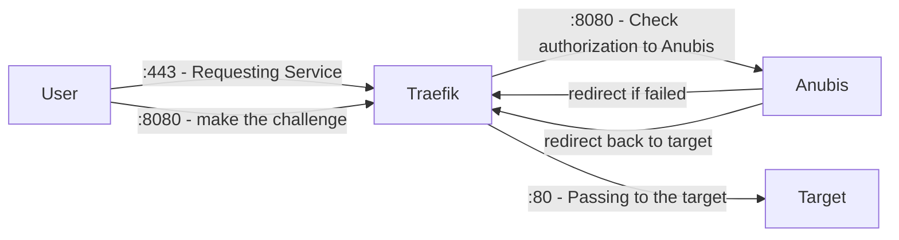

:::note

This only talks about integration through Compose,
but it also applies to docker cli options.

:::

In this example, we will use 4 Containers:

- `traefik` - the Traefik instance
- `anubis` - the Anubis instance
- `target` - our service to protect (`traefik/whoami` in this case)
- `target2` - a second service that isn't supposed to be protected (`traefik/whoami` in this case)

## Diagram of Flow

This is a small diagram depicting the flow.
Keep in mind that `8080` or `80` can be anything depending on your containers.



## Full Example Config

This example contains 3 services: anubis, one that is protected and the other one that is not.

**compose.yml**

```yml
services:
  traefik:
    image: traefik:v3.3
    ports:
      - 80:80
      - 443:443
    volumes:
      - /var/run/docker.sock:/var/run/docker.sock
      - ./letsencrypt:/letsencrypt
      - ./traefik.yml:/traefik.yml:ro
    networks:
      - traefik
    labels:
      # Enable Traefik
      - traefik.enable=true
      - traefik.docker.network=traefik
      # Anubis middleware
      - traefik.http.middlewares.anubis.forwardauth.address=http://anubis:8080/.within.website/x/cmd/anubis/api/check
      # Redirect any HTTP to HTTPS
      - traefik.http.middlewares.redirect-to-https.redirectscheme.scheme=https
      - traefik.http.routers.web.rule=PathPrefix(`/`)
      - traefik.http.routers.web.entrypoints=web
      - traefik.http.routers.web.middlewares=redirect-to-https
      - traefik.http.routers.web.tls=false

  anubis:
    image: ghcr.io/techarohq/anubis:main
    environment:
      # Telling Anubis, where to listen for Traefik
      - BIND=:8080
      # Telling Anubis to do redirect — ensure there is a space after '='
      - 'TARGET= '
      # Specifies which domains Anubis is allowed to redirect to.
      - REDIRECT_DOMAINS=example.com
      # Should be the full external URL for Anubis (including scheme)
      - PUBLIC_URL=https://anubis.example.com
      # Should match your domain for proper cookie scoping
      - COOKIE_DOMAIN=example.com
    networks:
      - traefik
    labels:
      - traefik.enable=true # Enabling Traefik
      - traefik.docker.network=traefik # Telling Traefik which network to use
      - traefik.http.routers.anubis.rule=Host(`anubis.example.com`) # Only Matching Requests for example.com
      - traefik.http.routers.anubis.entrypoints=websecure # Listen on HTTPS
      - traefik.http.services.anubis.loadbalancer.server.port=8080 # Telling Traefik where to receive requests
      - traefik.http.routers.anubis.service=anubis # Telling Traefik to use the above specified port
      - traefik.http.routers.anubis.tls.certresolver=le # Telling Traefik to resolve a Cert for Anubis

  # Protected by Anubis
  target:
    image: traefik/whoami:latest
    networks:
      - traefik
    labels:
      - traefik.enable=true # Enabling Traefik
      - traefik.docker.network=traefik # Telling Traefik which network to use
      - traefik.http.routers.target.rule=Host(`example.com`) # Only Matching Requests for example.com
      - traefik.http.routers.target.entrypoints=websecure # Listening on the exclusive Anubis Network
      - traefik.http.services.target.loadbalancer.server.port=80 # Telling Traefik where to receive requests
      - traefik.http.routers.target.service=target # Telling Traefik to use the above specified port
      - traefik.http.routers.target.tls.certresolver=le # Telling Traefik to resolve a Cert for Anubis
      - traefik.http.routers.target.middlewares=anubis@docker # Use the Anubis middleware

  # Not Protected by Anubis
  target2:
    image: traefik/whoami:latest
    networks:
      - traefik
    labels:
      - traefik.enable=true # Enabling Traefik
      - traefik.docker.network=traefik # Telling Traefik which network to use
      - traefik.http.routers.target2.rule=Host(`another.example.com`) # Only Matching Requests for example.com
      - traefik.http.routers.target2.entrypoints=websecure # Listening on the exclusive Anubis Network
      - traefik.http.services.target2.loadbalancer.server.port=80 # Telling Traefik where to receive requests
      - traefik.http.routers.target2.service=target2 # Telling Traefik to use the above specified port
      - traefik.http.routers.target2.tls.certresolver=le # Telling Traefik to resolve a Cert for this Target

networks:
  traefik:
    name: traefik
```

**traefik.yml**

```yml
api:
  insecure: false # shouldn't be enabled in prod

entryPoints:
  # Web
  web:
    address: ":80"
  websecure:
    address: ":443"

certificatesResolvers:
  le:
    acme:
      tlsChallenge: {}
      email: "admin@example.com"
      storage: "/letsencrypt/acme.json"

providers:
  docker: {}
```
